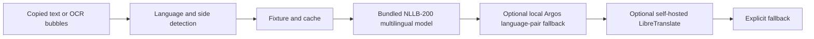

# TalkBridge MCP

TalkBridge(톡브릿지)는 서로 다른 언어를 쓰는 사람의 대화를 이해하고 답장하는 과정을 하나로 잇는 PlayMCP용 Streamable HTTP 서버입니다.

- 받은 메시지: 언어 자동 감지 후 내 언어로 번역
- 보낼 메시지: 한국어 맞춤법·말투 교정 후 상대 언어로 번역
- 대화 캡처: 왼쪽은 상대방, 오른쪽은 나로 복원해 여러 말풍선을 한 번에 처리
- 비용: OpenAI 및 유료 번역 API 없음
- 개인정보: 업로드 이미지와 메시지 원문을 저장하거나 로그에 남기지 않음

## MCP tools

| Tool | Purpose |
| --- | --- |
| `detect_chat_language` | 복사한 채팅의 언어를 감지합니다. |
| `translate_received_message` | 받은 메시지를 내 언어로 번역합니다. |
| `prepare_message_to_send` | 보낼 문장을 교정한 뒤 상대 언어로 번역합니다. |
| `bridge_chat_turn` | 받은 말 번역과 답장 준비를 한 번에 처리합니다. |
| `translate_chat_transcript` | OCR로 추출한 좌·우 말풍선 배열을 대화 순서대로 번역합니다. |
| `correct_korean_message` | 한국어 채팅의 맞춤법·띄어쓰기·문장부호를 교정합니다. |

모든 tool은 `name`, `description`, `inputSchema`, `annotations`를 포함합니다. Description은 공식 가이드에 맞춰 영문으로 작성하고 `TalkBridge(톡브릿지)`를 명시했습니다. Tool 이름과 서버 이름에는 금지 문자열을 사용하지 않습니다.

## Endpoints

- `POST /mcp`: Stateless Streamable HTTP MCP
- `GET /healthz`: 프로세스와 provider 상태
- `GET /readyz`: 번역 provider 준비 상태
- `GET /api/demo/languages`: 로컬 모델 지원 언어 목록
- `POST /api/demo/bridge-turn`: 텍스트 양방향 데모
- `POST /api/demo/image-bridge`: 대화 이미지 OCR·번역 데모
- `GET /`: PlayMCP 스타일 브라우저 데모

## Local development

```powershell
npm ci
npm run typecheck
npm test
npm run dev
```

기본 로컬 실행은 fixture, 캐시, 규칙 엔진으로 빠르게 동작합니다. 자유 문장 번역까지 로컬에서 확인하려면 Docker 프로덕션 이미지를 사용합니다.

```powershell
docker build -t talkbridge-mcp .
docker run --rm -p 3010:3000 talkbridge-mcp
```

프로덕션 Dockerfile은 NLLB-200 INT8 모델을 이미지 빌드 중 설치합니다. 첫 빌드는 약 600MB의 다국어 모델 다운로드 때문에 오래 걸릴 수 있지만 이후 요청마다 외부 API 비용이 발생하지 않습니다. Argos Translate는 로컬 개발에서만 선택 가능한 보조 경로로 분리해 공개 이미지의 크기와 메모리를 줄였습니다.

## Translation pipeline



일본어·영어·중국어·스페인어뿐 아니라 프랑스어, 독일어, 아랍어, 힌디어, 베트남어 등 83개 언어 코드를 자동 감지 또는 직접 지정할 수 있습니다. 입력 문장은 예문 일치가 아니라 로컬 신경망 번역으로 처리합니다. NLLB가 처리하지 못하면 선택적으로 설치된 Argos 경로를 사용하며, 끝까지 처리되지 않은 문장은 성공처럼 꾸미지 않고 `fallback: true`로 반환합니다.

## Safety

- 요청당 텍스트 2,000자, transcript 20개 말풍선, 이미지 8 MiB 제한
- 메모리 기반 rate limit과 번역 timeout 적용
- 원문, OCR 텍스트, 이미지 바이너리는 로그에 기록하지 않음
- 로그에는 provider, 언어 코드, 처리 시간, 메시지 수만 기록
- 인증이 필요하면 `MCP_BEARER_TOKEN`으로 Bearer 인증 활성화

## Submission

- [PlayMCP 제출 메모](docs/playmcp-submit.md)
- [기존 서비스 비교와 차별화](docs/competition-research.md)
- [카카오클라우드 배포](docs/deploy.md)
- [대화 이미지 처리](docs/image-bridge.md)
- [본선 Kakao Tools 확장](docs/kakao-tools-phase.md)

애플리케이션 코드는 MIT License입니다. 번들 가능한 NLLB 모델은 별도의 CC-BY-NC 4.0 조건을 따릅니다. 자세한 내용은 [MODEL_LICENSES.md](MODEL_LICENSES.md)를 확인하세요.

## 팀 시나브로

시나브로는 일상에서 자연스럽게 사용할 수 있는 Agentic AI 서비스를 만드는 2인 개발팀입니다.

| 역할 | 이름 | GitHub | 담당 업무 |
|---|---|---|---|
| 팀장 · MCP/백엔드 개발 | 신창준 | [@Festinz](https://github.com/Festinz) | 대화 UX 설계, 번역 엔진 연동, 배포 및 안정성 검증 |
| 팀원 · UX/테스트/문서화 | 박명환 | [@yuruha0605](https://github.com/yuruha0605) | MCP 서버 설계, 다국어 테스트 시나리오 작성, 서비스 문서화 |

## TalkBridge 소개

TalkBridge는 서로 다른 언어를 사용하는 사람들의 메신저 대화를 돕는 양방향 번역 MCP입니다.

받은 메시지의 언어를 자동으로 감지해 사용자의 언어로 번역하고, 사용자가 작성한 답장은 맞춤법과 문장을 교정한 뒤 상대방의 언어로 변환합니다. 대화 캡처 이미지에서 여러 말풍선을 추출하고 좌우 발화자를 구분해 번역하는 기능도 지원합니다.

## 핵심 기능

- 83개 언어 자동 감지 및 번역
- 받은 메시지를 사용자의 언어로 번역
- 보낼 메시지의 맞춤법과 문장 교정
- 교정된 답장을 상대방 언어로 변환
- 번역 결과의 한국어 역번역 제공
- 대화 캡처 OCR 및 좌우 말풍선 복원
- 유료 외부 API 없이 로컬 NLLB 모델로 처리

## 프로젝트 링크

- [PlayMCP에서 TalkBridge 사용하기](https://playmcp.kakao.com/mcp/70038607628431255)
- [TalkBridge GitHub 저장소](https://github.com/Festinz/talkbridge-mcp)