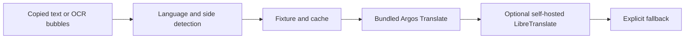

# TalkBridge MCP

TalkBridge(톡브릿지)는 서로 다른 언어를 쓰는 사람의 대화를 이해하고 답장하는 과정을 하나로 잇는 PlayMCP용 Streamable HTTP 서버입니다.

- 받은 메시지: 언어 자동 감지 후 내 언어로 번역
- 보낼 메시지: 한국어 맞춤법·말투 교정 후 상대 언어로 번역
- 대화 캡처: 왼쪽은 상대방, 오른쪽은 나로 복원해 여러 말풍선을 한 번에 처리
- 비용: OpenAI 및 유료 번역 API 없음
- 개인정보: 업로드 이미지와 메시지 원문을 저장하거나 로그에 남기지 않음

## MCP tools

| Tool | Purpose |
| --- | --- |
| `detect_chat_language` | 복사한 채팅의 언어를 감지합니다. |
| `translate_received_message` | 받은 메시지를 내 언어로 번역합니다. |
| `prepare_message_to_send` | 보낼 문장을 교정한 뒤 상대 언어로 번역합니다. |
| `bridge_chat_turn` | 받은 말 번역과 답장 준비를 한 번에 처리합니다. |
| `translate_chat_transcript` | OCR로 추출한 좌·우 말풍선 배열을 대화 순서대로 번역합니다. |
| `correct_korean_message` | 한국어 채팅의 맞춤법·띄어쓰기·문장부호를 교정합니다. |

모든 tool은 `name`, `description`, `inputSchema`, `annotations`를 포함합니다. Description은 공식 가이드에 맞춰 영문으로 작성하고 `TalkBridge(톡브릿지)`를 명시했습니다. Tool 이름과 서버 이름에는 금지 문자열을 사용하지 않습니다.

## Endpoints

- `POST /mcp`: Stateless Streamable HTTP MCP
- `GET /healthz`: 프로세스와 provider 상태
- `GET /readyz`: 번역 provider 준비 상태
- `POST /api/demo/bridge-turn`: 텍스트 양방향 데모
- `POST /api/demo/image-bridge`: 대화 이미지 OCR·번역 데모
- `GET /`: PlayMCP 스타일 브라우저 데모

## Local development

```powershell
npm ci
npm run typecheck
npm test
npm run dev
```

기본 로컬 실행은 fixture, 캐시, 규칙 엔진으로 빠르게 동작합니다. 자유 문장 번역까지 로컬에서 확인하려면 Docker 프로덕션 이미지를 사용합니다.

```powershell
docker build -t talkbridge-mcp .
docker run --rm -p 3010:3000 talkbridge-mcp
```

프로덕션 Dockerfile은 Argos Translate 모델을 이미지 빌드 중 설치합니다. 첫 빌드는 모델 다운로드 때문에 오래 걸릴 수 있지만 이후 요청마다 외부 API 비용이 발생하지 않습니다.

## Translation pipeline



현재 제출 MVP의 검증 언어는 한국어를 기준으로 일본어, 영어, 중국어, 스페인어입니다. Argos 모델 쌍은 `CHATPOLISH_ARGOS_MODEL_PAIRS`로 확장할 수 있습니다. 번역이 처리되지 않은 문장은 성공처럼 꾸미지 않고 `fallback: true`로 반환합니다.

## Safety

- 요청당 텍스트 2,000자, transcript 20개 말풍선, 이미지 8 MiB 제한
- 메모리 기반 rate limit과 번역 timeout 적용
- 원문, OCR 텍스트, 이미지 바이너리는 로그에 기록하지 않음
- 로그에는 provider, 언어 코드, 처리 시간, 메시지 수만 기록
- 인증이 필요하면 `MCP_BEARER_TOKEN`으로 Bearer 인증 활성화

## Submission

- [PlayMCP 제출 메모](docs/playmcp-submit.md)
- [기존 서비스 비교와 차별화](docs/competition-research.md)
- [카카오클라우드 배포](docs/deploy.md)
- [대화 이미지 처리](docs/image-bridge.md)
- [본선 Kakao Tools 확장](docs/kakao-tools-phase.md)

License: MIT
