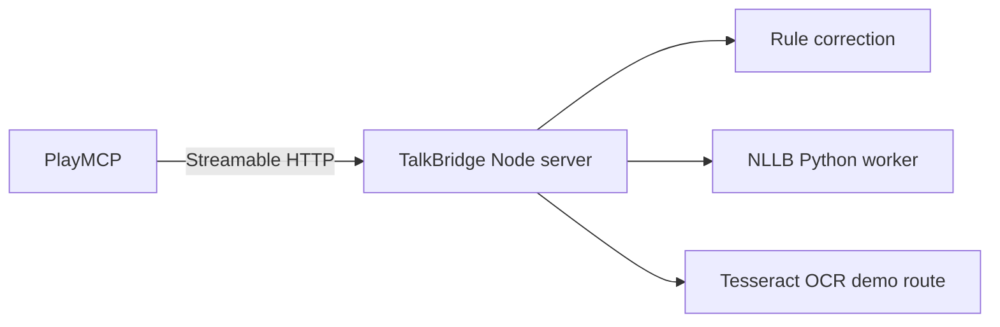

# 카카오클라우드 배포

공모전 예선은 PlayMCP in KC에서 제공하는 무상 서버를 사용합니다.

## 배포 구조



프로덕션 `Dockerfile`은 Node 서버, Tesseract.js, NLLB-200 INT8 Python 환경을 하나의 이미지에 포함합니다. 별도 OpenAI 키, 유료 번역 API, 외부 데이터베이스가 필요하지 않습니다. 대용량 PyTorch 의존성을 끌어오는 Argos는 공개 이미지에서 제외하고 로컬 선택 옵션으로 유지합니다.

## PlayMCP in KC

1. https://playmcp.kakaocloud.io/my-mcp 에 로그인합니다.
2. `새 MCP 서버 등록`에서 `Git 소스 빌드`를 선택합니다.
3. 서버 이름은 `TalkBridge`, 설명은 제출 문서의 콘솔 설명을 사용합니다.
4. 공개 Git URL과 `main` 브랜치를 입력합니다.
5. Dockerfile 경로는 `Dockerfile`, PAT는 비워둡니다.
6. `등록하기` 후 Status가 `Active`가 될 때까지 기다립니다.
7. 상세 화면의 Endpoint URL을 복사합니다.

이미지는 약 600MB의 NLLB 모델을 빌드 중 내려받으므로 첫 빌드가 오래 걸릴 수 있습니다.

서버 시작 시 NLLB 모델을 백그라운드에서 예열합니다. 단일 작업자 요청은 직렬 큐로 처리해 대화 캡처처럼 여러 문장이 동시에 들어와도 뒤쪽 요청의 timeout이 먼저 시작되지 않습니다. 배포 환경에서는 공개 Endpoint에서 다시 측정합니다.

스페인어 예문처럼 fixture에 없는 입력도 신경망 provider가 처리합니다. 83개 등록 언어는 `nllb-local`, 선택형 로컬 fallback은 `argos-local`로 반환되며 모두 `externalApi: false`입니다. Windows 로컬 CPU 검증에서는 NLLB 최초 로딩이 약 7.7초, 예열 후 대표 문장 번역은 약 0.4~0.8초였고 Python 작업자의 working set은 약 0.94GB였습니다. 공개 Endpoint에서는 다시 측정합니다.

2026-07-13 Docker smoke test 기준 이미지 크기는 약 760MB, 예열 후 컨테이너 메모리는 약 751MiB였습니다. 스페인어 자유 문장 HTTP 번역은 약 1.07초였고 MCP `initialize`, `tools/list`, `tools/call`이 모두 통과했습니다.

## 공개 Endpoint 확인

```powershell
Invoke-RestMethod https://YOUR-ENDPOINT/healthz
Invoke-RestMethod https://YOUR-ENDPOINT/readyz
```

MCP 확인 항목:

- initialize protocol version이 공식 허용 범위에 있는지 확인
- tools/list에 6개 tool이 노출되는지 확인
- `detect_chat_language`가 로컬에서 즉시 응답하는지 확인
- `bridge_chat_turn`이 받은 말과 답장을 한 응답에서 반환하는지 확인
- `translate_chat_transcript`가 좌·우 side를 유지하는지 확인
- 자유 문장 provider가 `nllb-local` 또는 `argos-local`이고 `externalApi: false`인지 확인
- 대표 언어별 예열 전후 응답 시간을 측정

## Local Docker

```powershell
docker build -t talkbridge-mcp .
docker run --rm -p 3010:3000 talkbridge-mcp
```

번역 모델 쌍 변경:

```text
CHATPOLISH_ARGOS_MODEL_PAIRS=en-ko,ko-en,en-ja,ja-en,en-zh,zh-en,en-es,es-en
```

NLLB 언어 카탈로그는 `workers/nllb_languages.json`에서 관리하며 현재 83개 언어 코드를 제공합니다. Argos는 프로덕션 이미지 외부의 선택형 로컬 fallback입니다.

## 운영 원칙

- 서버 로그에 메시지, OCR 원문, 이미지 데이터를 남기지 않습니다.
- `/healthz`는 프로세스 상태, `/readyz`는 번역 provider 상태를 반환합니다.
- rate limit과 입력 크기 제한을 유지합니다.
- 번역 실패는 원문을 성공 번역처럼 표시하지 않고 `fallback: true`로 반환합니다.
- 등록 후 먼저 임시 등록·도구함 테스트를 거친 다음 심사를 요청합니다.
