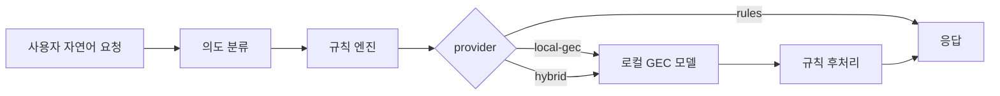

# Local Model Plan

## Why

규칙 엔진만으로는 정해진 패턴을 벗어난 자유 문장을 안정적으로 고치기 어렵습니다. 로컬 모델을 붙이면 사용자가 길고 애매하게 말해도 교정 후보를 만들 수 있습니다.

예:

```text
상사한테 너무 딱딱하지 않게 보내고 싶은데, 이거 자연스럽게 고쳐줘:
오늘 회의자료 확인부탁드립니다 혹시 수정사항 있으면 말해주세요
```

규칙 엔진은 띄어쓰기와 일부 말투만 고칩니다. 로컬 모델은 문장 전체의 흐름을 보고 더 자연스러운 후보를 만들 수 있습니다.

## Recommended Flow



## Setup

```bash
python -m venv .venv
.venv\Scripts\activate
pip install -r requirements-local-gec.txt
$env:CHATPOLISH_PROVIDER="hybrid"
npm run dev
```

## Model

- Default: `Soyoung97/gec_kr`
- Environment override: `CHATPOLISH_GEC_MODEL`
- Python override: `CHATPOLISH_PYTHON`
- Timeout: `CHATPOLISH_GEC_TIMEOUT_MS`

## Multilingual Translation

자유 문장 번역은 맞춤법 GEC와 별도의 로컬 번역 계층이 담당합니다.

1. NLLB-200 distilled 600M INT8: 하나의 모델로 83개 등록 언어를 직접 번역합니다.
2. Argos Translate: 로컬 개발에서 영어 허브를 거치는 선택형 fallback입니다.
3. LibreTranslate: 사용자가 직접 운영할 때만 선택적으로 연결합니다.

Docker 프로덕션 이미지는 NLLB만 번들하므로 OpenAI 키나 유료 번역 API가 필요하지 않습니다. Argos는 `requirements-argos.txt`와 언어 모델을 별도로 설치하고 `CHATPOLISH_ARGOS_ENABLED=1`로 설정한 로컬 환경에서만 선택적으로 사용합니다.

NLLB 환경 변수:

- `CHATPOLISH_NLLB_MODEL_PATH`
- `CHATPOLISH_NLLB_SENTENCEPIECE_PATH`
- `CHATPOLISH_NLLB_TIMEOUT_MS`
- `CHATPOLISH_NLLB_INTRA_THREADS`

Windows 로컬 검증에서는 아래 명령으로 중단 후 재개 가능한 다운로드와 설치를 실행합니다.

```powershell
.\scripts\download-nllb-model.ps1
```

설치 후 `.env.example`의 `.cache/nllb/model` 및 `.cache/nllb/sentencepiece.bpe.model` 경로를 사용합니다.

NLLB 모델은 CC-BY-NC 4.0이므로 현재 대회용 비상업 데모에만 사용합니다.

## Tradeoffs

- 장점: 외부 API 비용 없음, 개인정보가 외부 API로 나가지 않음, 자유 입력 대응 범위 증가
- 단점: 첫 실행 모델 다운로드 필요, CPU에서는 느릴 수 있음, 모델 품질은 OpenAI급 범용 LLM보다 좁을 수 있음

## Demo Policy

제출 데모에서는 `rules`를 기본값으로 두고, 로컬 모델을 설치한 환경에서는 `hybrid`를 켜서 보여줍니다. 로컬 모델이 실패하면 자동으로 규칙 엔진으로 fallback합니다.
